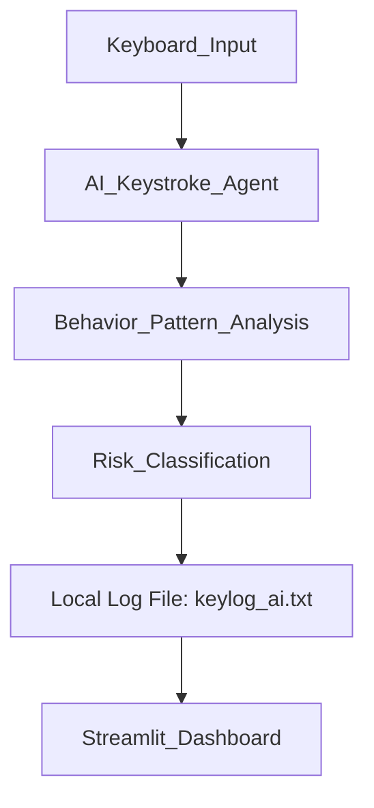

# 🧠 AI-Enhanced Keystroke Logging for Cybersecurity Awareness

## 📌 Project Overview
This project demonstrates how **keystroke logging techniques** can be analyzed in a **controlled and ethical environment** to improve **cybersecurity awareness**.

Instead of stealing sensitive information, the system focuses on **behavioral pattern analysis** to show how attackers infer sensitive activity and how defenders can detect such risks.

The project combines:
- A **local AI-enhanced keystroke logging agent**
- A **Streamlit dashboard** for visualization and awareness

---

## ⚠️ Ethical Disclaimer
> This project is strictly for **educational and cybersecurity awareness purposes only**.  
>  
> • No data is transmitted externally  
> • No credentials are stolen  
> • All logging is performed locally with user consent  
>  
> The goal is to understand **how keylogging attacks work** so that **better detection and prevention mechanisms** can be designed.

---

## 🏗️ System Architecture


*(Alternative text representation below if Mermaid is not supported)*
```text
Keyboard Input
↓
AI-Enhanced Keystroke Agent
↓
Behavior Pattern Analysis
↓
Risk Classification (PIN / Password / Normal)
↓
Local Log File (keylog_ai.txt)
↓
Streamlit Awareness Dashboard
```

---

## 🛠️ Technologies Used
- **Python**
- **pynput** – Keyboard event monitoring
- **Streamlit** – Visualization dashboard
- **Rule-based AI logic** – Behavioral inference

---

## ⚙️ How the System Works
1. The keystroke agent captures keyboard input locally.
2. Inputs are grouped into sessions.
3. Simple AI-inspired rules analyze:
   - Digits
   - Symbols
   - Typing duration
4. Each input is classified as:
   - Normal Input
   - Possible PIN Entry
   - Possible Password Entry
5. Results are stored locally in a log file.
6. Streamlit visualizes activity patterns and risk indicators.

---

## ▶️ How to Run the Project

### 1️⃣ Install dependencies
```bash
pip install -r requirements.txt
```

### 2️⃣ Run AI keystroke agent
```bash
python ai_keylogger_agent.py
```
*Type some sample input and stop using CTRL + C.*

### 3️⃣ Run Streamlit dashboard
```bash
streamlit run app.py
```

---

## 📊 Sample Output
```text
[POSSIBLE PIN ENTRY]        → 4829
[POSSIBLE PASSWORD ENTRY]   → pass@123
[NORMAL INPUT]              → hello this is demo
```

---

## 🎯 Learning Outcomes
- Understand how keylogging-based attacks operate
- Learn how attackers infer sensitive activity patterns
- Explore behavior-based cybersecurity detection
- Improve awareness of endpoint security threats

---

## 🛡️ Cybersecurity Insight
**Attackers often do not require exact passwords.**
Typing behavior alone can reveal sensitive activity.

This project demonstrates why:
1. **Endpoint protection is critical**
2. **Behavior-based detection is effective**
3. **User awareness is a strong defense**

---

## 📎 Project Type
Cybersecurity Awareness • Educational Demonstration • Ethical Research Prototype

---

## 🙏 Acknowledgment
This project was developed as part of the **VOIS For Tech** cybersecurity learning program to enhance practical understanding of real-world security threats.
